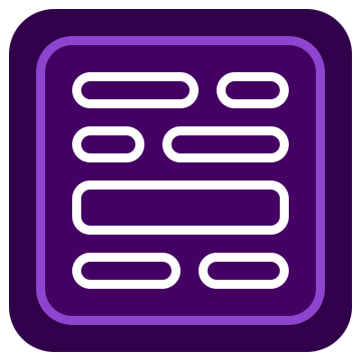
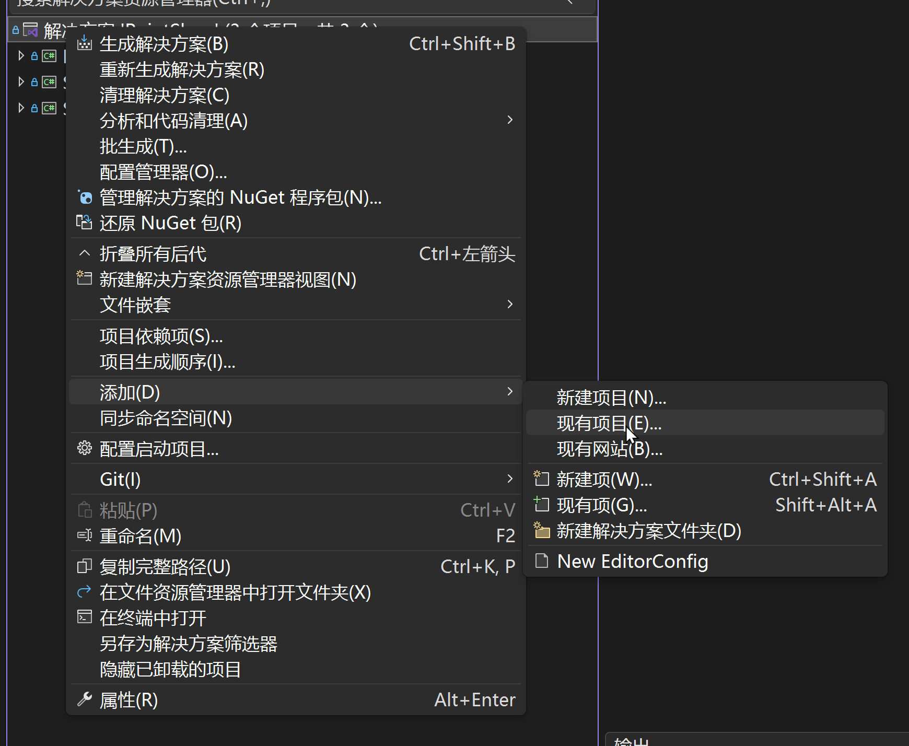
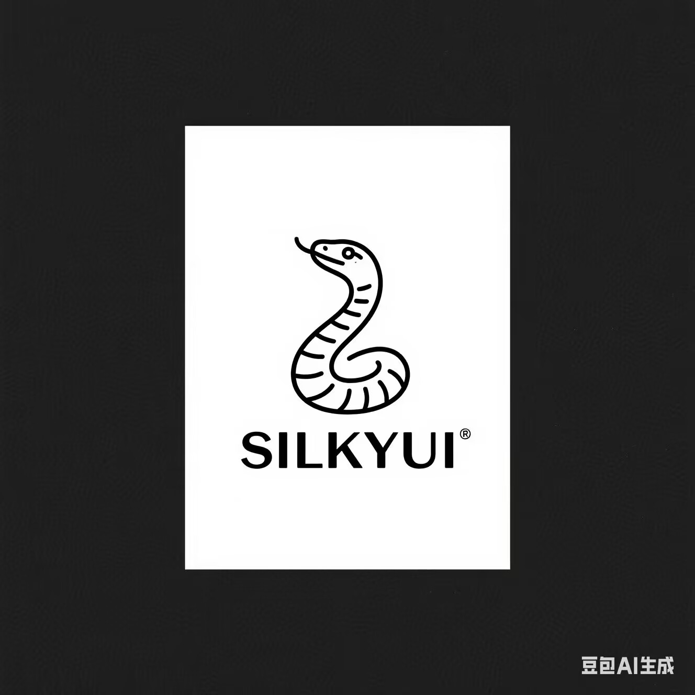

<div align="center">
    <h1>Silky User Interface Framework</h1>
    
    <h3>SilkyUI Framework</h3>
</div>

### 相关文档

[Flexbox 文档](FlexibleBoxModule.md)

[CSS Flexible Box Layout Module Level 1](https://www.w3.org/TR/css-flexbox-1/)

### TODO

1. [ ] Grid 布局设计与实现

### XML 初始模板：

```xml
<?xml version="1.0" encoding="utf-8" ?>
<!-- Class 填写对应类名 -->
<Body Class="SilkyUIFramework.UserInterfaces.MouseMenuUI">
    <!-- ElementGroup 是基本元素 -->
    <!-- Width 和 Height 的类型实现了 IParsable<TSelf>，演示的写法是支持的方式 -->
    <ElementGroup Width="100px 0%" Height="100%">
        <!-- 这是内置的文本元素，目前仅有简单支持，使用泰拉的 TextSnippet -->
        <TextView Text="Hello SilkyUI"/>
    </ElementGroup>
</Body>
```

### XML 属性转 C#对象 属性和字段赋值，支持的属性和字段类型:

1. 实现 IParsable<TSelf> 的任意类，会调用 Parse 方法进行解析。
2. float double char int string
3. Vector2 Vector3 Vector4 Color

### 如何使用？

SilkyUI Framework 是以前置 Mod 的方式在 tML 中使用的（为了不同 UI 之前的协同），
所以需要将其设置为前置 Mod。

> 由于使用了**增量生成器**，所以你还需要一同将生成器项目引用如你的 Mod 项目。

### 设为前置 Mod

在主 Mod 项目中的 build.txt 文件内添加模组引用

```txt
modReferences = SilkyUIFramework
```

### 克隆必要项目

在你的 ModSources 文件夹下运行以下两个 git clone 命令

```sh
git clone https://github.com/487666123/SilkyUIFramework.git
git clone https://github.com/487666123/SilkyUIAnalyzer
```

### 引入这两个项目

1. 将两个项目添加入你的解决方案中（选中 .csproj 文件）

2. 这两个项目会出现在你的解决方案中

3. 在你的项目的 .csporj 文件中添加这两个项目的引用
```xml
<ItemGroup>
    <ProjectReference Include="..\SilkyUIAnalyzer\SilkyUIAnalyzer.csproj">
        <OutputItemType>Analyzer</OutputItemType>
        <ReferenceOutputAssembly>false</ReferenceOutputAssembly>
    </ProjectReference>
    <ProjectReference Include="..\SilkyUIFramework\SilkyUIFramework.csproj"></ProjectReference>
</ItemGroup>
```

<hr/>

<div align=center>
    <h3>豆包生成的几个 LOGO</h3>
    
    
    
</div>